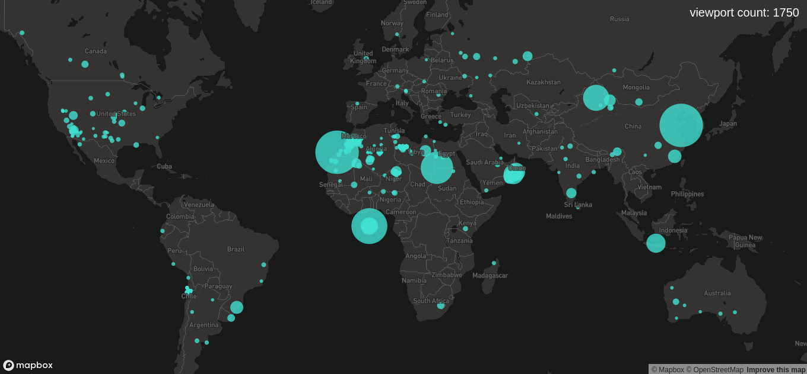

# dotgis-carto-vl

> CARTO VL React components 

[](https://www.npmjs.com/package/@dotgis/carto-vl)
[](https://github.com/microsoft/TypeScript)

***



### NPM Module

```bash
npm install @dotgis/carto-vl
```

### Example

```jsx
import mapboxgl from 'mapbox-gl';
import { SQLLayer } from '@dotgis/carto-vl';

const [mapObject, setMap] = React.useState();

React.useEffect(() => {
    const map = new Map({
      container: 'map-container',
      style: 'mapbox://styles/mapbox/dark-v10',
      center: [0, 15],
      zoom: 1.5
    });

    setMap(map);
}, []);

// in render()
{mapObject && (
  <SQLLayer
    mapInstance={mapObject}
    basemapId="waterway-label"
    name="test-layer"
    query={QUERY}
    fields={['cartodb_id']}
    user="dotgis"
    apiKey="default_public"
    width="(sqrt($testField) / 25) + 3"
    color="opacity(turquoise, 0.8)"
    strokeWidth={0}
  />
)}
```

***

## [SQLLayer](https://github.com/AdriSolid/dotgis-carto-vl/tree/master/examples/sql-layer)

Creates a new [CARTO VL SQL layer](https://carto.com/developers/carto-vl/reference/#cartosourcesql). Fetch MVT from a CARTO account.

If you change the value of some `carto.expressions`, it will automatically update this property using `blendTo`

### How to use

```jsx
import { SQLLayer } from '@dotgis/carto-vl';

...

<SQLLayer
    mapInstance={mapObject}
    basemapId="waterway-label"
    name="test-layer"
    query={QUERY}
    fields={['cartodb_id']}
    user="dotgis"
    apiKey="default_public"
  />
```

### Properties

* **mapInstance**: `object` Mapbox map object
* **basemapId** : `string` Basemap style
* **name** : `string` Layer name
* **query** : `string` SQL query to the CARTO account (must include 'cartodb_id' & 'the_geom_webmercator' fields)
* **fields** : `array` Fields to get the 'viewport features'. All the fields you include here must appear in the 'query' property string
* **user** : `string` CARTO account user name
* **apiKey** : `string` CARTO account API Key
* **color** (Default: `'rgba(0, 255, 0, .1)'`): `string` Could be: hexadecimal, hsl, hsla, hsv, hsva, namedColor, rgb or rgba
* **strokeColor** (Default: `'rgb(0, 255, 0)'`): `string` Stroke/border color of points and polygons, not applicable to lines
* **width** (Default: `1`): `number` Fill diameter of points, thickness of lines, not applicable to polygon
* **strokeWidth** (Default: `1`): `number` Stroke width of points and polygons, not applicable to lines
* **filter** (Default: `''`): `number` Filter features by removing from rendering and interactivity all the features that don't pass the test
* **minzoom** (Default: `1`): `number` Minimum zoom level for which tiles are available, as in the TileJSON spec
* **maxzoom** (Default: `22`): `number` Maximum zoom level for which tiles are available, as in the TileJSON spec. Data from tiles at the maxzoom are used when displaying the map at higher zoom level
* **visible** (Default: `true`): `boolean` Fill diameter of points, thickness of lines, not applicable to polygon
* **onLoaded** : `(message: string) => void` 'loaded' event will be fired when all the layers are loaded (and their 'loaded' events are fired)
* **featureClick** : `(event: any, coords: Coords) => void` featureClick events are fired when the user clicks on features. The list of features behind the cursor is provided
* **featureEnter** : `(event: any, coords: Coords) => void` featureEnter events are fired when the user moves the cursor and the movement implies that a non-previously hovered feature (as reported by featureHover or featureLeave) is now under the cursor. The list of features that are now behind the cursor and that weren't before is provided
* **featureLeave** : `(event: any) => void` featureLeave events are fired when the user moves the cursor and the movement implies that a previously hovered feature (as reported by featureHover or featureEnter) is no longer behind the cursor. The list of features that are no longer behind the cursor and that were before is provided
* **onInitialViewportFeatures** : `(event: any) => void` Generates a list of features in the viewport (on loaded). For each feature, the properties specified as arguments to this expression will be available. Filtered features will not be present in the list. This expression cannot be used for rendering
* **histogramVariables** : `DynamicVariables` (See 'histogramVariables' const above) Executing 'viewportHistogram' method from CARTO VL. The component accepts a prop called like that, passing the 'definition' object following '`DynamicVariables` type. At the same time, the 'props' object must be passed, with the name of the extracting features data methods as 'definition.method' value. Internally, the component is reading the full constant and creating dynamically CARTO VL Viz variables and adding new properties at `DynamicProps` interface (see types.ts) as component methods. Please always follow the histogramVariables' structure; 'histogramVariables.props' accepts 'n' methods, as long as 'histogramVariables.definition' (that is an array of objects) contains a 'name' for the variable name, an expression for the CARTO VL Viz expression and a 'method' (string) like the 'histogramVariables.props'.
* **mathVariables** : `DynamicVariables` (See 'histogramVariables' constant above & follow the **histogramVariables** explanation) Executing math viewport calculations methods from CARTO VL (viewportSum, viewportAvg, viewportMax...)
* **globalVariables** : `DynamicVariables` (See 'histogramVariables' constant above & follow the **histogramVariables** explanation) Executing global histogram viewport extracting methods from CARTO VL (globalHistogram)
* **labels** : 
  (Default: `labels: {
      `layout: {
        `textSize: 16,
        `textFont: ["Open Sans Regular", "Arial Unicode MS Regular"],
        `textLetterSpacing: 0,
        `textMaxWidth: 10,
        `textTransform: 'none'
      `},
      `paint: {
        `textColor: "#000000"
      `}
    `}`): `Labels` Adding pure Mapbox GL JS labelling methods. Required props are: field (rendered label) -string-, maxzoom & minzoom (zoom range to show or hide the labels layer) -number-

